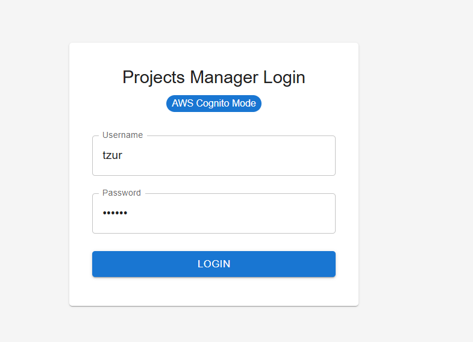
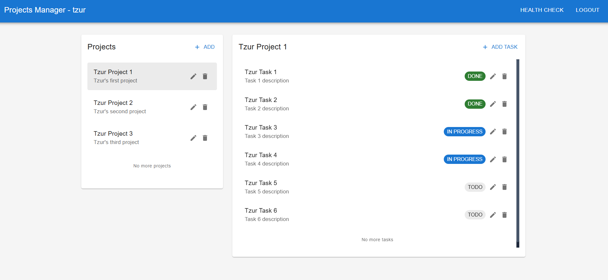
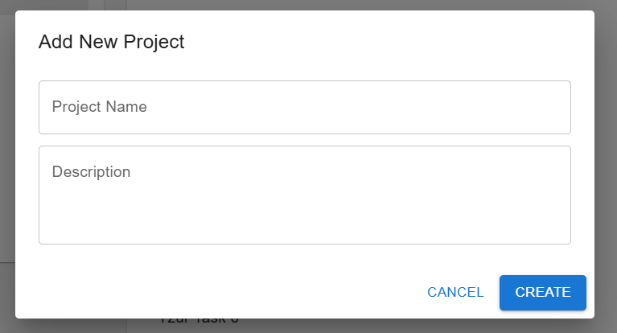
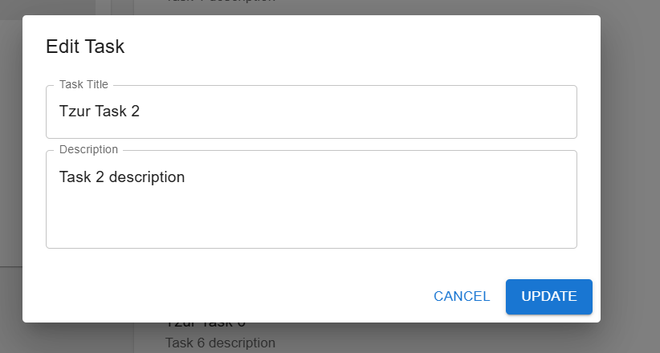
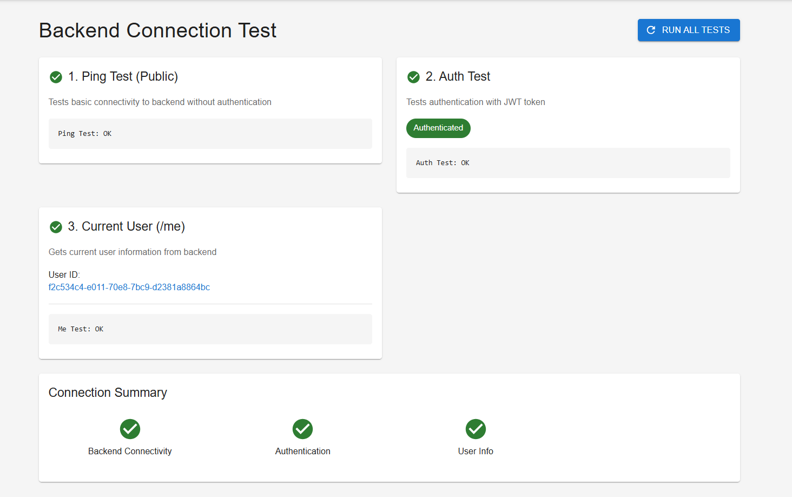

# Projects Manager - Task Management System

### Answers in Answers.md

A full-stack web application for managing projects and tasks with user authentication, built with Spring Boot (Java) backend and React (TypeScript) frontend.
### For login to the user on the frontend:
- user 1: tzur , password: 123456
- user 2: eden , password: 123456
## 🎯 Overview

This is a full-stack (backend oriented) task management application that allows users to:
- Create and manage projects
- Create and assign tasks within projects
- Track task status and priorities
- User authentication via AWS Cognito
- RESTful API backend with Swagger documentation

# login page:


# home page:




# health check page:


## ✨ Features

### Backend (Spring Boot)
- RESTful API with CRUD operations for Projects and Tasks
- User management and authentication
- AWS Cognito integration for secure authentication
- MySQL database integration
- Health check endpoints
- Swagger UI for API documentation
- Multiple environment profiles (dev, prod)

### Frontend (React + TypeScript)
- Modern React with TypeScript and Vite
- Material-UI components for sleek UI
- React Query for efficient data fetching and caching
- React Router for navigation
- Axios for HTTP requests
- Toast notifications for user feedback
- Health check monitoring

## 🛠 Tech Stack

### Backend
- **Java 17**
- **Spring Boot 3.1.5**
- **Spring Data JPA** - Database operations
- **MySQL** - Database
- **AWS Cognito** - Authentication
- **Maven** - Dependency management
- **Swagger/OpenAPI** - API documentation

### Frontend
- **React 18** - UI library
- **TypeScript** - Type safety
- **Vite** - Build tool and dev server
- **Material-UI (MUI)** - Component library
- **React Query (TanStack Query)** - Data fetching
- **React Router** - Routing
- **Axios** - HTTP client
- **React Toastify** - Notifications

## 📦 Prerequisites

Before running this project, ensure you have the following installed:

### Required
- **Java Development Kit (JDK) 17** or higher
- **Node.js 18+** and **npm**
- **MySQL 8.0+** or compatible database
- **Maven 3.6+** (or use the included Maven wrapper)
- **Git** (for version control)

### Optional
- AWS Cognito account (for authentication features)

## 📥 Installation

### 1. Clone the Repository
```bash
git clone https://github.com/Tzur-CS/Projects-Manager.git
cd Projects-Manager
```

### 2. Backend Setup

#### Configure Database
1. Make sure MySQL is running on your machine
2. Update database credentials in `src/main/resources/application.properties`:
```properties
spring.datasource.url=jdbc:mysql://localhost:3306/moveo-db?createDatabaseIfNotExist=true
spring.datasource.username=YOUR_MYSQL_USERNAME
spring.datasource.password=YOUR_MYSQL_PASSWORD
```

#### Configure AWS Cognito (Optional)
If using authentication, update in `application.properties`:
```properties
aws.cognito.userPoolId=YOUR_USER_POOL_ID
aws.cognito.clientId=YOUR_CLIENT_ID
aws.cognito.region=YOUR_REGION
```

#### Install Backend Dependencies
```bash
mvn clean install
```

### 3. Frontend Setup

#### Navigate to Frontend Directory
```bash
cd frontend-code/my-react-app
```

#### Install Dependencies
```bash
npm install
```

#### Configure Backend API URL
Update `src/config.ts` with your backend URL if needed:
```typescript
export const API_BASE_URL = 'http://localhost:8080';
```

## 🚀 How to Run

### Start the Backend

**Option 1: Dev Mode (With AWS Cognito)**
```bash
# From project root
mvn spring-boot:run -D"spring-boot.run.profiles=dev" 
```

**Option 2: Prod Mode (With AWS Cognito)**
```bash
# From project root
mvn spring-boot:run -D"spring-boot.run.profiles=prod" 
```

The backend will start on **http://localhost:8080**

### Start the Frontend

```bash
# From project root
cd frontend-code/my-react-app
npm run dev
```

The frontend will start on **http://localhost:5173**

### Access Points
- **Frontend UI**: http://localhost:5173
- **Backend API**: http://localhost:8080
- **Swagger API Docs**: http://localhost:8080/swagger-ui.html

## 📚 API Documentation

Once running, visit **http://localhost:8080/swagger-ui.html** for interactive API documentation.

### Main Endpoints
- **Projects**: `/api/projects` - CRUD operations for projects
- **Tasks**: `/api/tasks` - CRUD operations for tasks
- **Admin Projects**: `/api/admin/projects` - Admin-only access to all projects
- **Admin Tasks**: `/api/admin/tasks` - Admin-only access to all tasks
- **Health**: `/api/health` - Application health check

## 🔧 Configuration

### Environment Profiles
- **local**: No authentication, best for development
- **dev**: AWS Cognito authentication enabled
- **prod**: Full security, production settings

### Database Configuration
Edit `src/main/resources/application.properties`:
```properties
spring.datasource.url=jdbc:mysql://localhost:3306/moveo-db
spring.datasource.username=root
spring.datasource.password=your_password
```

## 📝 Project Structure

```
moveo-project/
├── src/main/java/               # Backend Java code
│   ├── config/                  # Security, database config
│   ├── project/                 # Project entity & controllers
│   ├── task/                    # Task entity & controllers
│   ├── user/                    # User entity & controllers
│   └── exception/               # Error handling
├── frontend-code/my-react-app/  # Frontend React code
│   └── src/
│       ├── components/          # React components
│       ├── pages/               # Page components
│       ├── hooks/               # Custom hooks
│       └── services/            # API services
└── src/main/resources/          # Configuration files
```

